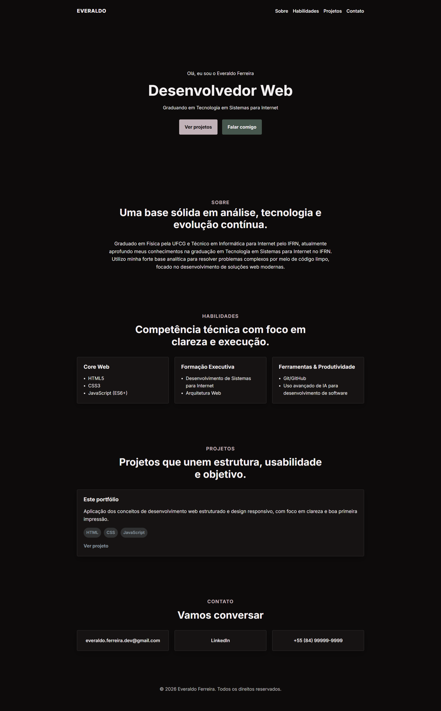

# Portfólio Profissional - Everaldo Ferreira

<p align="center">
  
</p>

Projeto de portfólio pessoal focado em demonstrar solidez técnica, clareza e competência para recrutadores e clientes freelance. 

O projeto foi desenvolvido sob medida aplicando conceitos de desenvolvimento web estruturado, design responsivo e código limpo através do aprendizado prático no minicurso "Programar com IA" da B7Web.

## 🚀 Sobre o Projeto

O site conecta o raciocínio lógico da minha formação acadêmica inicial à construção de aplicações web eficientes e escaláveis. O layout preza pelo minimalismo e objetividade, evitando elementos visuais desnecessários para focar no que realmente importa: o código e a usabilidade.

### Características Principais
- **Foco em Performance:** Sem animações pesadas ou imagens de stock redundantes.
- **Mobile-First:** Responsividade total adaptada estritamente para dispositivos móveis e desktops.
- **Abordagem Analítica:** Estrutura limpa que reflete uma sólida base de resolução de problemas complexos.

## 🛠️ Tecnologias e Habilidades

O projeto foi estruturado utilizando as seguintes competências técnicas:

*   **Core Web:** HTML5, CSS3 e JavaScript (ES6+).
*   **Formação Executiva:** Desenvolvimento de Sistemas para Internet e Arquitetura Web.
*   **Ferramentas & Produtividade:** Git, GitHub e uso avançado de IA para desenvolvimento de software.

## 💻 Seções do Site

*   **Hero:** Apresentação de impacto destacando a transição da Física para Sistemas para Internet (TSI).
*   **Sobre:** Resumo da trajetória acadêmica (UFCG e IFRN) focado em evolução contínua.
*   **Projetos:** Vitrine em formato de cards estruturados com descrição, tecnologias e links de acesso.
*   **Contato:** Canal direto "Vamos conversar" com links integrados para redes profissionais.

## 🔗 Como Acessar

Você pode ver o portfólio online rodando aqui: **[Link do seu Deploy aqui]**

## 🔧 Execução Local

Se quiser clonar o repositório e rodar o projeto localmente:

```bash
# Clonar o repositório
git clone https://github.com

# Entrar na pasta
cd seu-projeto

# Abrir o index.html no navegador
```

